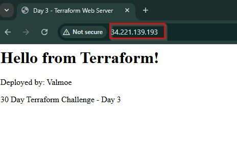
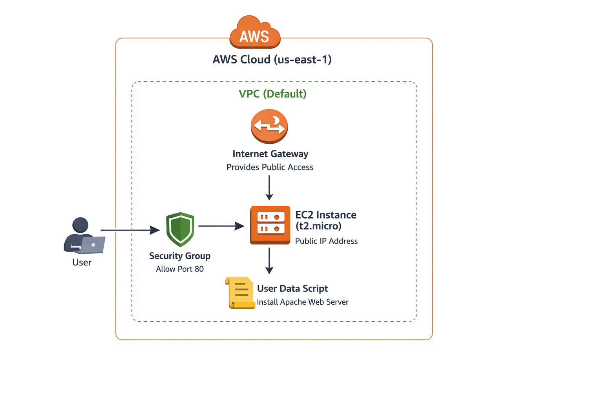

# Deploying Your First Server with Terraform: A Beginner's Guide

## Introduction
Theory ends today. I'm deploying my first real server using Terraform, and I want to walk you through every step, from writing the configuration to seeing a web page load from a cloud instance I provisioned entirely through code. This is where Infrastructure as Code transforms from concept to reality.

## Understanding the Building Blocks
Before writing code, I needed to understand two fundamental Terraform concepts from Chapter 2:

- Provider Block: Declares which cloud platform Terraform will manage. It's the bridge between Terraform and AWS's API. Without it, Terraform doesn't know where to create resources.
- Resource Block: Defines a specific piece of infrastructure (EC2 instance, security group, S3 bucket). Each resource has a type (aws_instance) and a name (web_server) that together create a unique identifier.

My First Terraform Configuration
Here's my complete main.tf file, explained block by block:

```bash
hcl
# Provider Block
# Tells Terraform to use AWS and which region to deploy resources in
provider "aws" {
  region = "us-east-1"
}

# Security Group Resource
# Defines firewall rules controlling traffic to our server
resource "aws_security_group" "web_sg" {
  name        = "web-security-group"
  description = "Allow HTTP inbound traffic"

  # Allow HTTP from anywhere (0.0.0.0/0)
  ingress {
    description = "HTTP from Internet"
    from_port   = 80
    to_port     = 80
    protocol    = "tcp"
    cidr_blocks = ["0.0.0.0/0"]
  }
  ingress {
    description = "SSH from Internet"
    from_port   = 22
    to_port     = 22
    protocol    = "tcp"
    cidr_blocks = ["0.0.0.0/0"]  # Restrict to your IP in production
  }
  
  # Allow all outbound traffic
  egress {
    from_port   = 0
    to_port     = 0
    protocol    = "-1"
    cidr_blocks = ["0.0.0.0/0"]
  }
}

# EC2 Instance Resource
# The actual virtual server we'll deploy
resource "aws_instance" "web_server" {
  ami           = "ami-0c7217cdde317cfec"  # Ubuntu 22.04 LTS in us-east-1
  instance_type = "t2.micro"               # Free tier eligible
  
  # Attach the security group we defined above
  vpc_security_group_ids = [aws_security_group.web_sg.id]
  
  # User data script runs on first boot to set up the web server
  user_data = <<-EOF
              #!/bin/bash
              apt-get update
              apt-get install -y apache2
              systemctl start apache2
              systemctl enable apache2
              echo "<h1>Hello from Terraform! Day 3 Complete 🚀</h1>" > /var/www/html/index.html
              EOF

  tags = {
    Name = "Terraform-Day3-Server"
  }
}
```

## Block-by-Block Explanation:
- Provider Block: provider "aws" initializes the AWS provider. I specified us-east-1 to match my configured region. This single block gives Terraform access to hundreds of AWS resource types.

- Security Group Resource: aws_security_group.web_sg creates a firewall. The ingress rule allows HTTP (port 80) from any IP address—necessary for a public web server but overly permissive for production. The egress rule allows the server to reach the internet for updates.

- EC2 Instance Resource: aws_instance.web_server is the compute resource. Key parameters:
    1. ami: Amazon Machine Image—this specific ID is Ubuntu 22.04 in us-east-1. AMIs are region-specific.
    2. instance_type: t2.micro is free-tier eligible but limited to 1 vCPU and 1GB RAM
    3. vpc_security_group_ids: References the security group created above using         aws_security_group.web_sg.id. This creates a dependency—Terraform knows to create the   security group first.
    4. user_data: A shell script that runs once at boot time. It installs Apache and creates a simple web page.

## The Terraform Workflow
### Step 1: Initialize (terraform init)

```bash
$ terraform init

Initializing the backend...
Initializing provider plugins...
- Finding latest version of hashicorp/aws...
- Finding latest version of hashicorp/random...
- Installing hashicorp/aws v6.37.0...
- Installed hashicorp/aws v6.37.0 (signed by HashiCorp)
- Installing hashicorp/random v3.8.1...
- Installed hashicorp/random v3.8.1 (signed by HashiCorp)
Terraform has created a lock file .terraform.lock.hcl to record the provider
selections it made above. Include this file in your version control repository
so that Terraform can guarantee to make the same selections by default when
you run "terraform init" in the future.

```

This downloads the AWS provider plugin and sets up the working directory. Run this once per project or when adding new providers.

### Step 2: Plan (terraform plan)

```bash
$ terraform plan

Terraform will perform the following actions:

  # aws_instance.web_server will be created
  + resource "aws_instance" "web_server" {
      + ami                          = "ami-0c7217cdde317cfec"
      + instance_type                = "t2.micro"
      + public_ip                    = (known after apply)
      ...
    }

  # aws_security_group.web_sg will be created
  + resource "aws_security_group" "web_sg" {
      ...
    }

Plan: 2 to add, 0 to change, 0 to destroy.
```

terraform plan is your safety net. It shows exactly what will change without making any modifications. Review this carefully as it's your last chance to catch mistakes before they cost money.

### Step 3: Apply (terraform apply)

```bash
$ terraform apply

aws_security_group.web_sg: Creating...
aws_security_group.web_sg: Creation complete after 3s [id=sg-0123456789abcdef0]
aws_instance.web_server: Creating...
aws_instance.web_server: Still creating... [10s elapsed]
aws_instance.web_server: Creation complete after 45s [id=i-0123456789abcdef0]

Apply complete! Resources: 2 added, 0 changed, 0 destroyed.

Outputs:

instance_id = "i-0eb31xxxxxxxx"
public_ip = "34.221.139.193"
public_url = "http://34.221.139.193"
```

Terraform created the security group first (dependency), then the EC2 instance. The entire process took under a minute.

### Verification
I opened a browser and navigated to http://34.221.139.193.
The page loaded successfully. Infrastructure as Code just became real infrastructure.


### Cleanup (terraform destroy)

```bash
$ terraform destroy

aws_instance.web_server: Destroying... [id=i-0123456789abcdef0]
aws_instance.web_server: Destruction complete after 30s
aws_security_group.web_sg: Destroying... [id=sg-0123456789abcdef0]
aws_security_group.web_sg: Destruction complete after 1s

Destroy complete! Resources: 2 destroyed.
```

Always destroy resources when done. Unused EC2 instances cost money, and security groups left open are attack vectors.

## What Broke and How I Fixed It
1. Error 1: "InvalidAMIID.NotFound"
    Cause: I initially used an AMI ID from a different region
    Fix: Found the correct Ubuntu 22.04 AMI for us-east-1 using the AWS Console (EC2 → Launch Instance → Copy AMI ID)
2. Error 2: Security group wasn't attaching to the instance
    Cause: I used security_groups instead of vpc_security_group_ids
    Fix: Changed to vpc_security_group_ids for VPC-based EC2 instances (the modern default)
3. Error 3: Web page didn't load initially
    Cause: Apache installation takes time; I checked too quickly
    Fix: Added a 2-minute wait after instance creation, then verified. In production, use a provisioner or health check.

Architecture Diagram
I created a diagram showing:
AWS Cloud (us-east-1 region)
VPC (default)
Internet Gateway (provides public access)
EC2 Instance (t2.micro) with public IP
Security Group (port 80 open)
User Data script installing Apache


## Key Takeaways
1. Dependencies are automatic: Terraform knew to create the security group before the EC2   instance because I referenced aws_security_group.web_sg.id in the instance resource.
2. Plan is protection: Reviewing the plan caught my AMI region mismatch before it caused a failure.
3. State is truth: Terraform maintains a terraform.tfstate file tracking real infrastructure. Never edit it manually.
4. User data is powerful: One script turned a blank server into a working web server automatically.

## Conclusion
Deploying my first server with Terraform felt like magic, but it's actually rigorous engineering. The provider and resource blocks are simple concepts with profound implications thus every piece of infrastructure becomes repeatable, version-controlled, and reviewable.