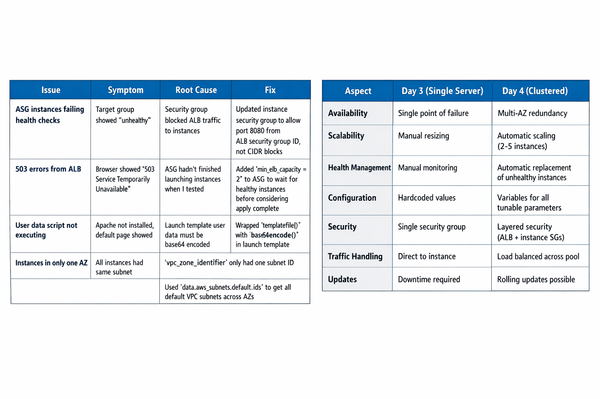
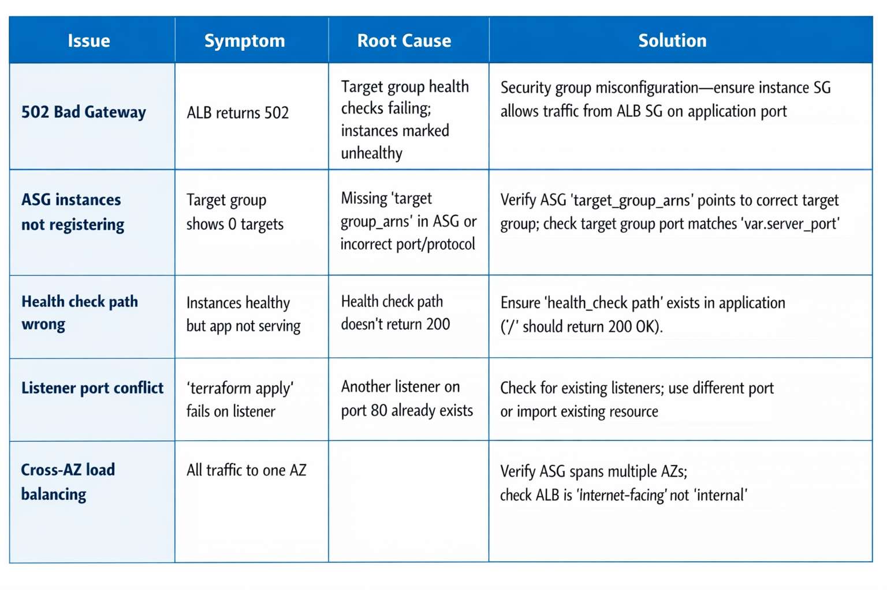

# Managing High Traffic Applications with AWS Elastic Load Balancer and Terraform

## Introduction
Today marks a pivotal shift from building infrastructure to understanding the machinery that makes it reliable at scale. I completed my load-balanced, auto-scaling architecture and then dove deep into Terraform's most critical (and misunderstood) component: state. If you don't understand state, you don't understand Terraform. Period.

## Completing the Scaled Architecture
Yesterday I built the foundation with Auto Scaling Groups and basic networking. Today I added the traffic management layer that makes this production-ready: the Application Load Balancer (ALB).

## Why an ALB Changes Everything
Without a load balancer, traffic goes directly to instances. This creates three fatal problems:

1. No Health Awareness: Traffic routes to failed instances until someone manually intervenes
2. No Distribution: One instance gets overwhelmed while others sit idle
3. No Elasticity: When instances scale in or out, DNS records must manually update

The ALB solves all three. It continuously health-checks instances, distributes requests intelligently, and automatically registers/deregisters instances as the ASG scales.

## The Complete Production Architecture
Here's my final configuration:

### variables.tf:
```bash
variable "aws_region" {
  description = "AWS region"
  type        = string
  default     = "us-west-2"
}

variable "instance_type" {
  description = "EC2 instance type"
  type        = string
  default     = "t3.micro"  # Free tier eligible
}
variable "server_port" {
  description = "The port the server will use for HTTP requests"
  type        = number
  default     = 8080
}
variable "environment" {
  description = "Environment name (dev, stag, prod)"
  type        = string
  default     = "dev"
}
variable "cluster_name" {
  description = "Name for the cluster resources"
  type        = string
  default     = "terraform-web"
}

variable "min_size" {
  description = "Minimum number of instances in ASG"
  type        = number
  default     = 2
}

variable "max_size" {
  description = "Maximum number of instances in ASG"
  type        = number
  default     = 5
}

variable "desired_capacity" {
  description = "Desired number of instances in ASG"
  type        = number
  default     = 2
}
```

### main.tf:
```bash
terraform {
  required_version = ">= 1.0.0"
  required_providers {
    aws = {
      source  = "hashicorp/aws"
      version = "~> 5.0"
    }
  }
}

provider "aws" {
  region = var.aws_region
}

# Data Sources - Dynamic discovery of AWS resources
data "aws_availability_zones" "all" {
  state = "available"
}

data "aws_vpc" "default" {
  default = true
}

data "aws_subnets" "default" {
  filter {
    name   = "vpc-id"
    values = [data.aws_vpc.default.id]
  }
}

data "aws_ami" "amazon_linux" {
  most_recent = true
  owners      = ["amazon"]

  filter {
    name   = "name"
    values = ["amzn2-ami-hvm-*-x86_64-gp3"]
  }

  filter {
    name   = "virtualization-type"
    values = ["hvm"]
  }
}

# Security Group for ALB - Public-facing
resource "aws_security_group" "alb_sg" {
  name        = "${var.cluster_name}-alb-sg"
  description = "Security group for ALB - allows public HTTP"

  ingress {
    from_port   = 80
    to_port     = 80
    protocol    = "tcp"
    cidr_blocks = ["0.0.0.0/0"]
    description = "Allow HTTP from anywhere"
  }

  egress {
    from_port   = 0
    to_port     = 0
    protocol    = "-1"
    cidr_blocks = ["0.0.0.0/0"]
  }

  tags = {
    Name        = "${var.cluster_name}-alb-sg"
    Environment = var.environment
  }
}

# Security Group for Instances - Internal only
resource "aws_security_group" "instance_sg" {
  name        = "${var.cluster_name}-instance-sg"
  description = "Security group for web instances - ALB access only"

  ingress {
    from_port       = var.server_port
    to_port         = var.server_port
    protocol        = "tcp"
    security_groups = [aws_security_group.alb_sg.id]
    description     = "Allow traffic only from ALB"
  }

  egress {
    from_port   = 0
    to_port     = 0
    protocol    = "-1"
    cidr_blocks = ["0.0.0.0/0"]
  }

  tags = {
    Name        = "${var.cluster_name}-instance-sg"
    Environment = var.environment
  }
}

# Launch Template - Blueprint for ASG instances
resource "aws_launch_template" "web" {
  name_prefix   = "${var.cluster_name}-lt"
  image_id      = data.aws_ami.amazon_linux.id
  instance_type = var.instance_type
  
  vpc_security_group_ids = [aws_security_group.instance_sg.id]
  
  user_data = base64encode(templatefile("${path.module}/user-data.sh", {
    server_port = var.server_port
    environment = var.environment
  }))

  tag_specifications {
    resource_type = "instance"
    tags = {
      Name        = "${var.cluster_name}-instance"
      Environment = var.environment
    }
  }

  lifecycle {
    create_before_destroy = true
  }
}

# Application Load Balancer
resource "aws_lb" "web" {
  name               = "${var.cluster_name}-alb"
  load_balancer_type = "application"
  subnets            = data.aws_subnets.default.ids
  security_groups    = [aws_security_group.alb_sg.id]

  tags = {
    Name        = "${var.cluster_name}-alb"
    Environment = var.environment
  }
}

# Target Group - Health checks and routing
resource "aws_lb_target_group" "web" {
  name     = "${var.cluster_name}-tg"
  port     = var.server_port
  protocol = "HTTP"
  vpc_id   = data.aws_vpc.default.id

  health_check {
    enabled             = true
    healthy_threshold   = 2
    unhealthy_threshold = 2
    timeout             = 3
    interval            = 15
    path                = "/"
    port                = "traffic-port"
    matcher             = "200"
    protocol            = "HTTP"
  }

  tags = {
    Name        = "${var.cluster_name}-tg"
    Environment = var.environment
  }
}

# ALB Listener - Routes incoming traffic
resource "aws_lb_listener" "http" {
  load_balancer_arn = aws_lb.web.arn
  port              = 80
  protocol          = "HTTP"

  default_action {
    type             = "forward"
    target_group_arn = aws_lb_target_group.web.arn
  }
}

# Auto Scaling Group - Manages instance fleet
resource "aws_autoscaling_group" "web" {
  name                = "${var.cluster_name}-asg"
  vpc_zone_identifier = data.aws_subnets.default.ids
  target_group_arns   = [aws_lb_target_group.web.arn]
  health_check_type   = "ELB"  # Use ALB health checks, not just EC2
  health_check_grace_period = 300

  min_size         = var.min_size
  max_size         = var.max_size
  desired_capacity = var.desired_capacity

  launch_template {
    id      = aws_launch_template.web.id
    version = "$Latest"
  }

  tag {
    key                 = "Name"
    value               = "${var.cluster_name}-instance"
    propagate_at_launch = true
  }

  tag {
    key                 = "Environment"
    value               = var.environment
    propagate_at_launch = true
  }

  tag {
    key                 = "ManagedBy"
    value               = "Terraform"
    propagate_at_launch = true
  }
}
```

### outputs.tf - Expose critical information
```bash
output "alb_dns_name" {
  description = "DNS name of the load balancer"
  value       = aws_lb.web.dns_name
}

output "alb_zone_id" {
  description = "Route 53 zone ID of the load balancer"
  value       = aws_lb.web.zone_id
}

output "target_group_arn" {
  description = "ARN of the target group"
  value       = aws_lb_target_group.web.arn
}

output "asg_name" {
  description = "Name of the Auto Scaling Group"
  value       = aws_autoscaling_group.web.name
}

output "asg_min_size" {
  description = "Minimum size of the ASG"
  value       = aws_autoscaling_group.web.min_size
}

output "asg_max_size" {
  description = "Maximum size of the ASG"
  value       = aws_autoscaling_group.web.max_size
}
```

### user-data.sh:

```bash
#!/bin/bash
set -e

# Update system
yum update -y
yum install -y httpd

# Configure httpd to listen on the correct port BEFORE starting
sed -i "s/Listen 80/Listen ${server_port}/g" /etc/httpd/conf/httpd.conf

# Update VirtualHost port if present
sed -i "s/<VirtualHost \*:80>/<VirtualHost *:${server_port}>/g" /etc/httpd/conf/httpd.conf

# Create custom index page showing instance identity
cat > /var/www/html/index.html <<EOF
<!DOCTYPE html>
<html>
<head>
    <title>Terraform Day 5 - Load Balanced Cluster</title>
    <style>
        body { font-family: Arial, sans-serif; margin: 40px; }
        .container { max-width: 600px; margin: 0 auto; }
        .info { background: #f0f0f0; padding: 20px; border-radius: 5px; }
        h1 { color: #232f3e; }
        .highlight { color: #ff9900; font-weight: bold; }
    </style>
</head>
<body>
    <div class="container">
        <h1>🚀 Hello from Terraform Day 5!</h1>
        <div class="info">
            <p><strong>Environment:</strong> <span class="highlight">${environment}</span></p>
            <p><strong>Server Port:</strong> <span class="highlight">${server_port}</span></p>
            <p><strong>Hostname:</strong> <span class="highlight">$(hostname -f)</span></p>
            <p><strong>Instance ID:</strong> <span class="highlight">$(curl -s http://169.254.169.254/latest/meta-data/instance-id)</span></p>
            <p><strong>Availability Zone:</strong> <span class="highlight">$(curl -s http://169.254.169.254/latest/meta-data/placement/availability-zone)</span></p>
            <p><strong>Local IP:</strong> <span class="highlight">$(curl -s http://169.254.169.254/latest/meta-data/local-ipv4)</span></p>
        </div>
        <p><em>Served by AWS Application Load Balancer</em></p>
    </div>
</body>
</html>
EOF

# Start and enable httpd
systemctl start httpd
systemctl enable httpd

echo "Setup complete at $(date)"
```

## Deployment Verification
```bash
$ terraform apply
# ... apply output ...

$ terraform output

alb_dns_name = "terraform-web-alb-215715150.us-west-2.elb.amazonaws.com"
alb_zone_id = "Z1H1FL5HABSF5"
asg_max_size = 5
asg_min_size = 2
asg_name = "terraform-web-asg"
target_group_arn = "arn:aws:elasticloadbalancing:us-west-2:715840489346:targetgroup/terraform-web-tg/a7d1bc2639ee4c97"

$ curl http://terraform-web-alb-215715150.us-west-2.elb.amazonaws.com
# Returns HTML with instance details

$ curl http://terraform-web-alb-215715150.us-west-2.elb.amazonaws.com
# Returns HTML with DIFFERENT instance details (different AZ, IP, instance ID)
# Proof that ALB is distributing traffic across multiple instances
```

## Failure Testing:
I manually stopped one EC2 instance via the AWS Console. Within 60 seconds:
- The ALB health check marked it unhealthy
- Traffic stopped routing to it
- The ASG detected the unhealthy instance and launched a replacement
- The new instance registered with the target group and began receiving traffic

Zero manual intervention. That's production infrastructure.

## Understanding Terraform State: The Source of Truth
Now for the critical part. While the infrastructure was deploying, I explored the terraform.tfstate file, Terraform's most important and dangerous component.

## What is Terraform State?
State is a JSON file that maps your configuration (the code) to real infrastructure (the cloud resources). It's not just a record rather it's the single source of truth for Terraform's operations.

### What State Actually Contains:
```bash
{
  "version": 4,
  "terraform_version": "1.14.7",
  "serial": 8,
  "lineage": "ab797a47-a568-9564-6fbb-54e144944872",
  "outputs": {
    "alb_dns_name": {
      "value": "terraform-web-alb-215715150.us-west-2.elb.amazonaws.com",
      "type": "string"
    }
  "resources": [
    {
      "mode": "data",
      "type": "aws_ami",
      "name": "amazon_linux",
      "provider": "provider[\"registry.terraform.io/hashicorp/aws\"]",
      "instances": [
        {
          "schema_version": 0,
          "attributes": {
            "architecture": "x86_64",
            "arn": "arn:aws:ec2:us-west-2::image/ami-0534a0fd33c655746",
            "block_device_mappings": [
              {
                "device_name": "/dev/xvda",
                "ebs": {
                  "delete_on_termination": "true",
                  "encrypted": "false",
                  "iops": "0",
                  "snapshot_id": "snap-0e79fe3ea2b228c28",
                  "throughput": "0",
                  "volume_initialization_rate": "0",
                  "volume_size": "8",
                  "volume_type": "gp2"
                },
                "no_device": "",
                "virtual_name": ""
              }
            ],
            "boot_mode": "",
            "creation_date": "2026-02-26T18:38:03.000Z",
            "deprecation_time": "2026-05-27T18:40:00.000Z",
            "description": "Amazon Linux 2 AMI 2.0.20260302.0 x86_64 HVM gp2",
            "ena_support": true,
            "executable_users": null,
            "filter": [
              {
                "name": "name",
                "values": [
                  "amzn2-ami-hvm-*-x86_64-gp2"
                ]
              },
              {
                "name": "virtualization-type",
                "values": [
                  "hvm"
                ]
              }
    },
```

## Critical Observations:
1. Resource IDs: The id field (i-0534a0fd33c655746) is the AWS-assigned identifier. Without this, Terraform can't correlate code with reality.
2. Dependencies: The dependencies array shows the dependency graph Terraform built. It knows the instance depends on the security group and AMI data source.
3. Attribute Caching: State caches resource attributes (IPs, ARNs, tags) to avoid constant API calls. This is why terraform plan is fast, it compares code against state rather than against AWS (initially).
4. Serial Number: The serial field increments with every change. Remote backends use this for optimistic locking.
5. Lineage: A UUID for this state file. Prevents accidentally overwriting state from different projects.

## Experiment 1: Manual State Tampering
I edited terraform.tfstate directly (never do this in production):
1. Changed "instance_type": "t3.micro" to "instance_type": "t2.micro"
2. Saved the file
3. Ran terraform plan

### Result:
```bash
Terraform detected the following changes made outside of Terraform since the last "terraform apply":

  # aws_instance.web_server has been changed
  ~ resource "aws_instance" "web_server" {
        id                           = "i-0a1b2c3d4e5f67890"
      ~ instance_type                = "t3.micro" -> "t2.micro"
        # (30 unchanged attributes hidden)
    }

Unless you have made equivalent changes to your configuration, or ignored the
relevant attributes using ignore_changes, the following plan may include
actions to undo the changes made outside of Terraform.
```

Terraform detected the discrepancy between state and reality. It proposed changing the instance type back to match my code. I restored the original state value to avoid any actual changes.

### Lesson: 
State is not just a cache rather it's a contract. When state and reality diverge, Terraform tries to reconcile. Manual state editing creates "ghost" resources that Terraform thinks exist but don't (or vice versa).

## Experiment 2: State Drift (Console Changes)
Went to AWS Console → EC2 → Instances
Found my instance i-0a1b2c3d4e5f67890
Added a tag manually: ValmoeManualTag = "letsCheckHowItBehaves"
Did NOT touch Terraform code
Ran terraform plan
### Result:
```bash 
Note: Objects have changed outside of Terraform

Terraform detected the following changes made outside of Terraform since the last "terraform apply":

  # aws_instance.web_server has been changed
  ~ resource "aws_instance" "web_server" {
        id                           = "i-0a1b2c3d4e5f67890"
      + tags                         = {
          + ValmoeManualTag = "letsCheckHowItBehaves"
        }
        # (30 unchanged attributes hidden)
    }

Unless you have made equivalent changes to your configuration...
```
Terraform detected the drift. It proposed removing the tag to match the code. This is drift detection, a core Terraform feature.

### Critical Implication: 
If someone manually changes infrastructure (console, CLI, other tools), Terraform will detect it and propose reversing those changes on the next apply. This enforces infrastructure as code discipline.

## Why State Files Must Never Be Committed to Git
1. Sensitive Data: State contains plaintext secrets. My state had user_data (base64 encoded but easily decoded), private IPs, and security group rules. In real projects, state often contains database passwords, API keys, and TLS certificates.
2. Merge Conflicts: State changes with every apply. Teams would face constant merge conflicts.
3. No Locking: Git doesn't provide state locking. Two team members could simultaneously run terraform apply, corrupting state.
4. Size: State files can grow to megabytes (especially with many resources), bloating repositories.

## Remote State Storage: The Production Solution
Instead of local files, use remote backends:
S3 Backend (Recommended for AWS):
```bash
resource "aws_s3_bucket" "terraform_state" {
  bucket = "valmoe-terraform-state-bucket"
}

resource "aws_s3_bucket_versioning" "terraform_state" {
  bucket = aws_s3_bucket.terraform_state.id
  versioning_configuration {
    status = "Enabled"
  }
}

#Needed for state locking to prevent concurrent modifications within teams
resource "aws_dynamodb_table" "terraform_locks" {
  name         = "valmoe-terraform-locks"
  billing_mode = "PAY_PER_REQUEST"
  hash_key     = "LockID"

  attribute {
    name = "LockID"
    type = "S"
  }
}

#Comment out the backend configuration for local state storage until we set up the S3 bucket and DynamoDB table for remote state management
# Backend configuration for remote state storage in S3 with DynamoDB for locking
terraform {
  backend "s3" {
    bucket         = "valmoe-terraform-state-bucket"
    key            = "dev/terraform.tfstate"
    region         = "us-west-2"
    encrypt        = true
    use_lockfile    = true
  }
}
```

## Benefits:
- Encryption at rest: S3 encrypts state files
- Versioning: S3 keeps history of state changes, rollback to any previous version
- Access control: IAM policies control who can read/write state
- State locking: DynamoDB table prevents concurrent modifications

## State Locking: Why It Matters
When two engineers run terraform apply simultaneously:
1. Without locking: Both read the same state, both make changes, last write wins—corruption guaranteed
2. With DynamoDB locking: First acquires lock, second waits or fails with "state locked" message
Locking is non-negotiable for teams. Data loss from state corruption can take days to recover from.

## Terraform Block Comparison Table


## Best Practices for State Management
1. Use remote backends: S3 (AWS), GCS (GCP), Azure Blob Storage, or Terraform Cloud
2. Enable encryption: Always encrypt state at rest and in transit
3. Enable versioning: S3 versioning protects against accidental deletion
4. Use locking: DynamoDB for S3, native locking for other backends
5. Limit access: State contains secrets thus apply least-privilege IAM policies
6. Separate state per environment: Never share state between production and development
7. Run terraform plan regularly: Detect drift before it becomes critical
8. Never manually edit state: Use terraform state commands for safe manipulations

## What I Learned from Chapter 3
State management is where Terraform transitions from "convenient tool" to "enterprise-grade infrastructure platform." The state file is not an implementation detail rather it's the heart of Terraform's operation. Understanding state locking, remote backends, and drift detection separates engineers who can safely manage production from those who will eventually cause outages.

## Common ALB Setup Challenges


## Conclusion
Today I built infrastructure that can handle real traffic and survive real failures. More importantly, I understand the machinery keeping it consistent. Terraform state isn't a side effect rather it's a deliberate design that enables team collaboration, drift detection, and safe concurrent operations. Master state management, and you've mastered the foundation of Infrastructure as Code at scale.